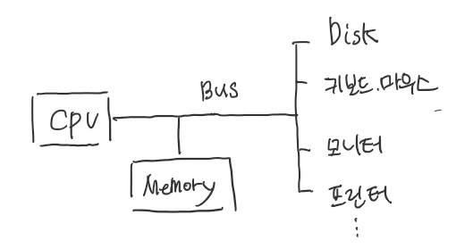

# 컴퓨터의 구성요소들

## 컴퓨터의 구성

**컴퓨터 시스템**은 기본적으로 하드웨어와 소프트웨어로 구성된다.

- **하드웨어** : 컴퓨터를 구성하는 기계적인 장치
    - 중앙처리장치 (CPU)
    - 기억장치 (RAM, HDD)
    - 입출력 장치 : 마우스, 프린터, 스피커, 터치 스크린 등
- **소프트웨어** : 하드웨어의 동작을 지시하고 제어하는 명령어의 집합
    - 시스템 소프트웨어 : 운영체제, 컴파일러
    - 응용 소프트웨어 : 크롬, 스프레드 시트, 자바로 만든 서버, 게임 등등

위의 하드웨어 장치들은 모두 마더보드에 올라가거나 연결된다.

장치들은 모두 마더보드에 올라가거나 연결된다.

하드웨어는 중앙처리장치, 주기억장치와 보조기억장치, 입출력장치로 구성되며 각 장치는 시스템 버스(데이터와 명령 제어 신호를 각 장치로 전달하는 역할)로 연결되어 있다.

## 중앙처리장치(CPU, 마이크로프로세서)

- 주기억장치에서 프로그램 **명령어와 데이터를 읽어와 처리**
- 명령어의 **수행 순서를 제어**
- 비교와 연산을 담당하는 **산술논리연산장치**(ALU), 명령어의 해석과 실행을 담당하는 **제어장치**, 속도가 빠른 데이터 기억장소인 **레지스터**로 구성됨

## 기억장치

### 주기억장치

- **RAM**(Random Access Memory) : **읽고 쓰기가 가능**하며, 응용프로그램이나 OS 등을 불러와 CPU가 작업할 수 있게하는 기억장치. **휘발성**.
- **ROM**(Read Only Memory) :  오직 기억된 데이터를 **읽기만 가능**하며 **비휘발성**. 그래서 시스템에 기억시키고 변화시키면 안 되는 BIOS와 같은 주요 데이터는 여기에 저장된다.

둘 다 ‘영구적으로 쓰기’는 불가능하다. 따라서 사용자가 보통 데이터를 저장하게 되는 곳은 주기억장치가 아닌 보조기억장치이다.

### 보조기억장치

> 주기억장치에 비해 **읽기 속도가 느린 대신**, 컴퓨터 전원이 꺼지더라도 데이터가 영구적으로 저장되는 장치.

- 하드디스크(HDD)
- SSD

> 놀라운 사실 : C드라이브가 C드라이브인 이유는, A 드라이브와 B 드라이브(옛날 플로피디스크)가 더 이상 안 쓰이기 때문

## 시스템 버스

> 각 하드웨어 구성 요소를 물리적으로 연결해, 서로 데이터를 전달할 수 있도록 하는 통로

- 데이터 버스 : 중앙처리장치 (연산결과) ↔ 기억장치, 입출력 장치 (명령어와 데이터)
- 주소 버스 : 중앙처리 장치 (기억장치 주소) ➡️ 주기억장치 혹은 입출력 장치
- 제어 버스 : 중앙처리 장치 (제어 신호) ➡️ 주기억장치 혹은 입출력 장치
    - 제어 신호 종류 : 기억장치 읽기 및 쓰기, 버스 요청 및 승인, 인터럽트 요청 및 승인, 클락, 리셋 등

# 참조

- 컴퓨터 구조 및 설계 - David A. Patterson
- [**https://ndb796.tistory.com/6**](https://ndb796.tistory.com/6)
- [https://hongong.hanbit.co.kr/컴퓨터의-4가지-핵심-부품cpu-메모리-보조기억장/](https://hongong.hanbit.co.kr/%EC%BB%B4%ED%93%A8%ED%84%B0%EC%9D%98-4%EA%B0%80%EC%A7%80-%ED%95%B5%EC%8B%AC-%EB%B6%80%ED%92%88cpu-%EB%A9%94%EB%AA%A8%EB%A6%AC-%EB%B3%B4%EC%A1%B0%EA%B8%B0%EC%96%B5%EC%9E%A5/)
- [https://en.wikipedia.org/wiki/Computer_architecture](https://en.wikipedia.org/wiki/Computer_architecture)
- [https://dheldh77.tistory.com/entry/컴퓨터구조-시스템-버스System-bus](https://dheldh77.tistory.com/entry/%EC%BB%B4%ED%93%A8%ED%84%B0%EA%B5%AC%EC%A1%B0-%EC%8B%9C%EC%8A%A4%ED%85%9C-%EB%B2%84%EC%8A%A4System-bus)

Table of Contents

- [컴퓨터 구조와 기능, CPU](#컴퓨터-구조와-기능,-CPU)

# 컴퓨터구조
## 컴퓨터 구조와 기능, CPU
   

컴퓨터 구조는 위 그림과 같이 4가지로 나눌 수 있다.
* CPU : 중앙처리장치. 데이터를 처리하는 역할
* Memory : 데이터를 저장하는 기능을 수행
* I/O : 컴퓨터와 외부장치 사이에 데이터를 교환하는 기능을 수행
* System Bus : 위의 모든 컴퓨터 시스템 구성요소들을 연결하여 데이터 전송을 수행   

컴퓨터의 기능 역시 크게 4가지로 나눌 수 있다.
* Data Processing : 데이터 연산
* Data Storage : 데이터 저장
* Data Movement : 데이터 통신, 이동
* Control : 제어(명령수행, 리소스 관리 등)   

### CPU (Central Processing Unit, 중앙 처리 장치)
컴퓨터에서 구성 단위 중 `기억, 해석, 연산, 제어`라는 4대 기능을 종합하는 중앙 처리 장치의 줄임말.   

### 프로세서
* 컴퓨터 운영을 위해 기본적인 명령어에 반응하고 처리하는 논리회로   
* 디바이스가 해야할 일을 총 지휘하는 프로세서를 CPU라고 함(보통 프로세서와 CPU를 같은 의미로 사용)   
* 이외의 프로세스는 제어장치(Control Unit), 연산장치(ALU)이 있다   

### 코어
코어란 각종 연산을 하는 **CPU 핵심요소**. 코어가 1개면 싱글코어, 2개면 듀얼코어, 4개면 쿼드코어라고 하며, 코어 수가 많을수록 병렬 처리 효율이 늘어날 수 있습니다.   

### CPU 세부 사항
다음은 8세대 이후 인텔 CPU를 비교한 그림입니다.   
   

몬스터는 코어수, 팔 개수는 스레드 수를 의미합니다.   

### 스레드
코어는 CPU를 물리적으로 구별한 것이고, 쓰레드는 CPU를 논리적으로 구별했다고 보면 됩니다. 일반적으로 코어개수와 CPU 개수는 같지만 인텔같은 경우 하이퍼쓰레딩(Hyper Threading) 기술로 코어의 갯수를 반으로 쪼개는 기술이 이용됩니다.

   

### 클럭
CPU를 비롯한 컴퓨터의 모든 부품들은 일정한 간격(속도0으로 발생되는 전기적 신호)에 맞춰 동작하는데 이 전기적 신호를 클럭이라고 합니다.

단순히 정리하면 클럭이 높을수록 CPU 연산속도가 빠르고 성능이 좋습니다. 하지만 클럭이 높을수록 열을 그만큼 많이 발생하겠죠. 따라서 CPU마다 적정선이 존재합니다.

참고로 오버클럭은 말 그대로 클럭 수치를 적정 클럭보다 오버시켜서 부품에 부여하는 것입니다.

### 참고 자료
[참고 자료 1](https://velog.io/@ckstn0777/%EC%BB%B4%ED%93%A8%ED%84%B0%EA%B5%AC%EC%A1%B0-%EC%BB%B4%ED%93%A8%ED%84%B0-%EA%B5%AC%EC%A1%B0%EC%99%80-%EA%B8%B0%EB%8A%A5-CPU) [참고 자료 2](https://donghoson.tistory.com/entry/CPU-%ED%94%84%EB%A1%9C%EC%84%B8%EC%84%9C-%EC%BD%94%EC%96%B4-%EA%B0%99%EC%9D%80-%EC%9A%A9%EC%96%B4%EC%9D%B8%EA%B0%80) [참고 자료 3](https://dmzld.tistory.com/18)